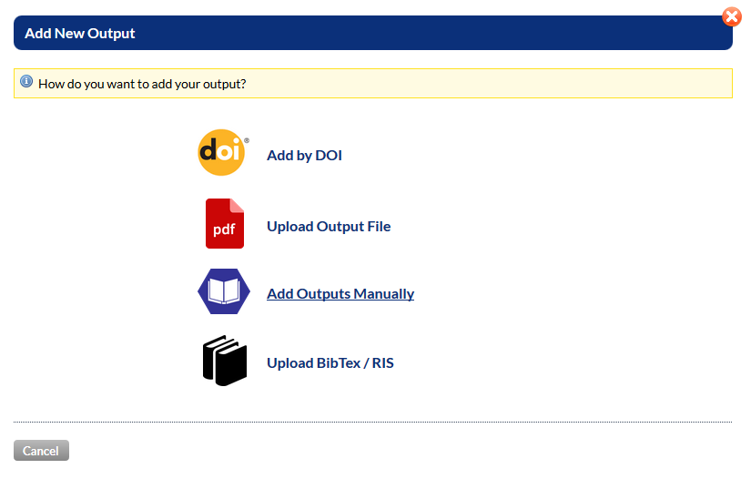

## How to report software outputs in RIS

This guide shows the method for recording software outputs in RIS as implemented at the University of Not![Imatingham (3rd April 2019).

From the menu bar select **Outputs->Add New Output**

Four input options are given. For software outputs either using a DOI or manual input are appropriate.

# Add Manually

In order to select a software output use **Type->Digital Artifact**. This enables the **Digital Artefact Type** dropdown menu from which **Software** can be selected. 
**Publication Status** can be selected as **Published** for Open Source.

The **Media** option is a mandatory field. In this case **Online** is chosen for software which is downloadable online.

The rest of the fields are optional and can be edited from the Outputs page at a later date if not input at this stage.

On completion of the desired fields select **Create Output**

**Add Authors**
Outputs added manually will not have any authors or contributors associated with them. To add these select the **Authors** tab from the output record and use the green **Edit** button to add authors.

