This guide has been written with reference to the Pure instance at the
University of St Andrews, which is version 5.13.1 at the time of writing.

Create a new Research Output from template Non-textual form > Software

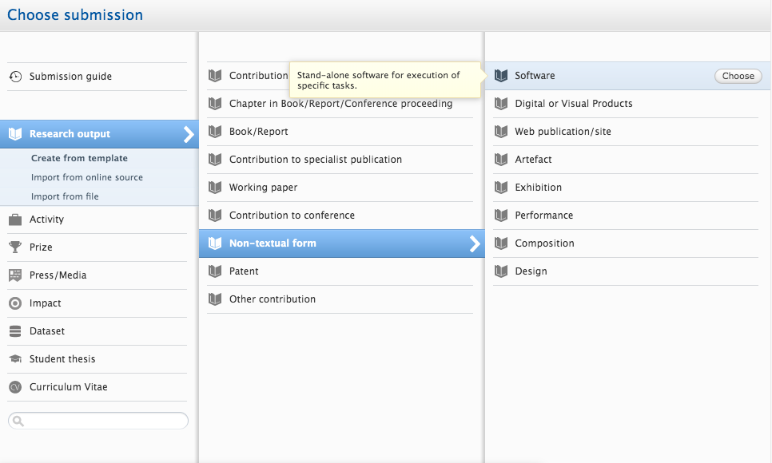

Then you will see the following input form:

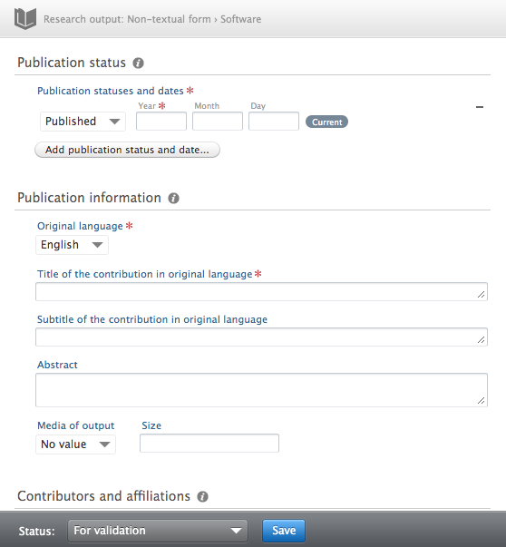

Enter publication status(es) and date(s).

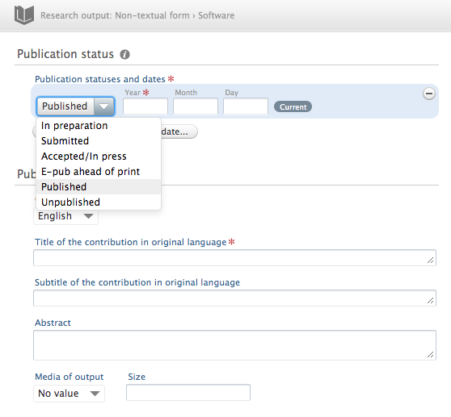

"Published" and "Unpublished" are likely to be the relevant options.

Enter the publication information.

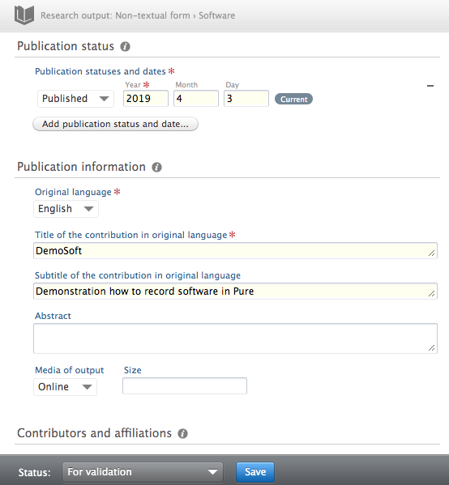

Leave "media of output" as "No value".

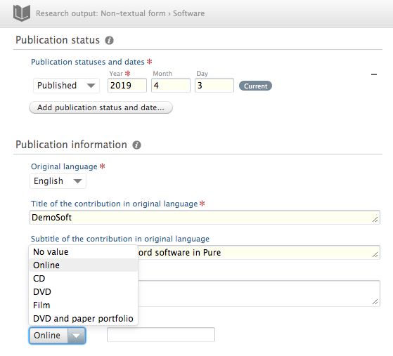

Add contributors. "Developer" is likely the most useful role; "Author" may be
suitable for writers od documentation. There is no suitable role for
maintainers, testers etc. - you should use "Other".

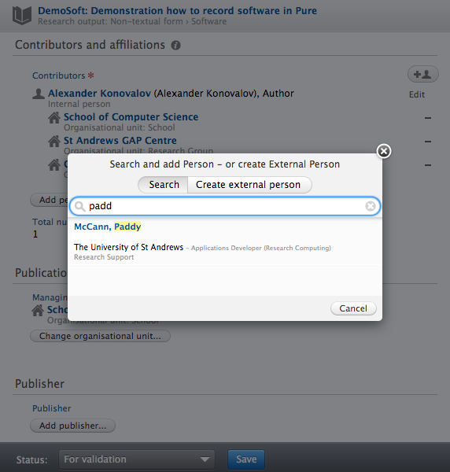

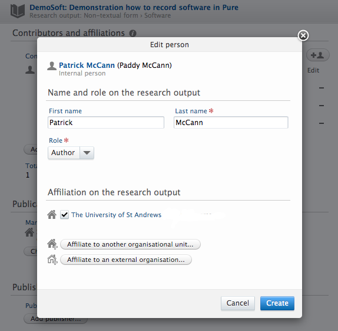

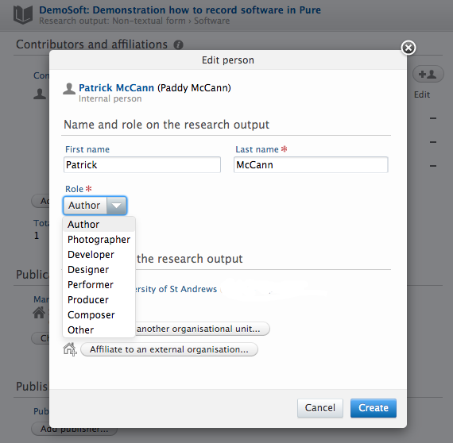

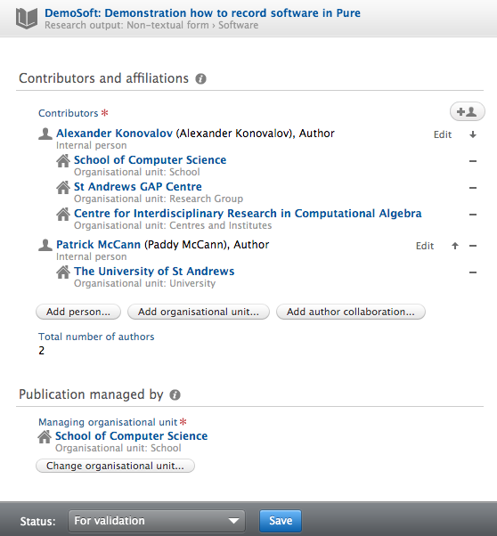

Change the managing organisational unit if necessary.

"Electronic version(s), and related files and links" is where you can link to
an external resource and/or upload files. In particular, if you have a DOI you
should add it here.

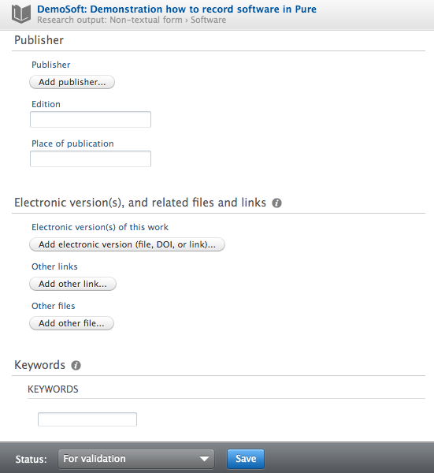

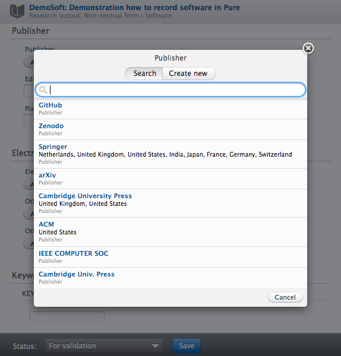

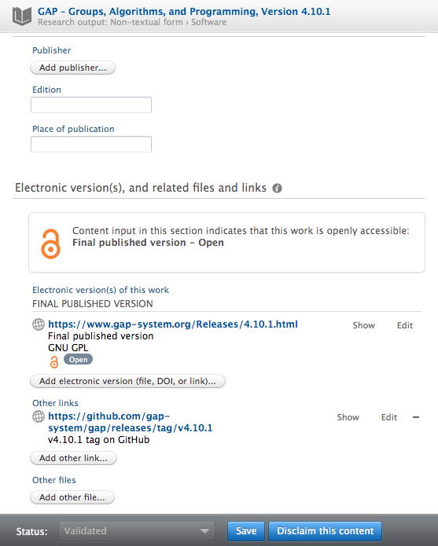

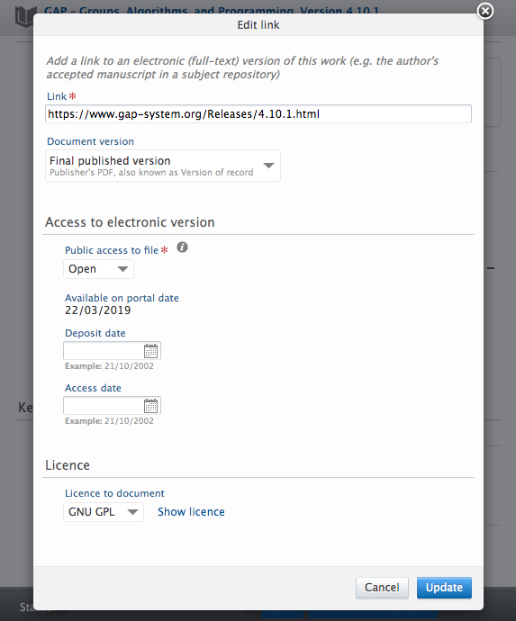

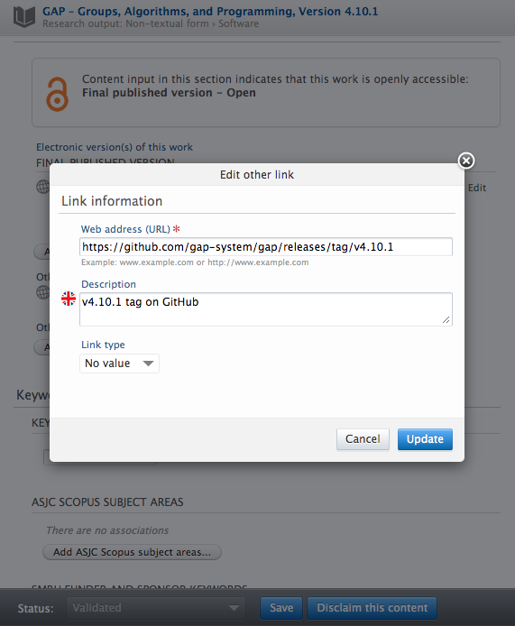

When adding keywords, try and be consistent with what you have used elsewhere
(e.g. on GitHub) but try and avoid creating new keywords unnecessarily.

Link the record to any relevant existing records in Pure - Research Outputs
(papers), Acitvities, Projects, Datasets etc.

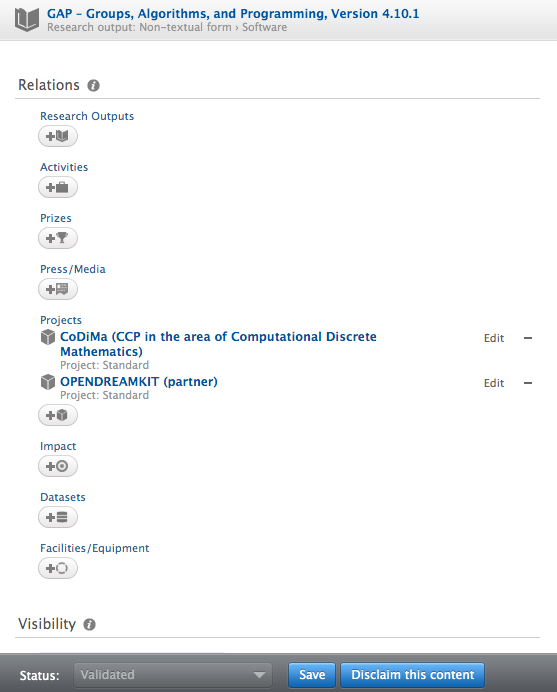

Set the visibility according to how you wish the record to be available.

