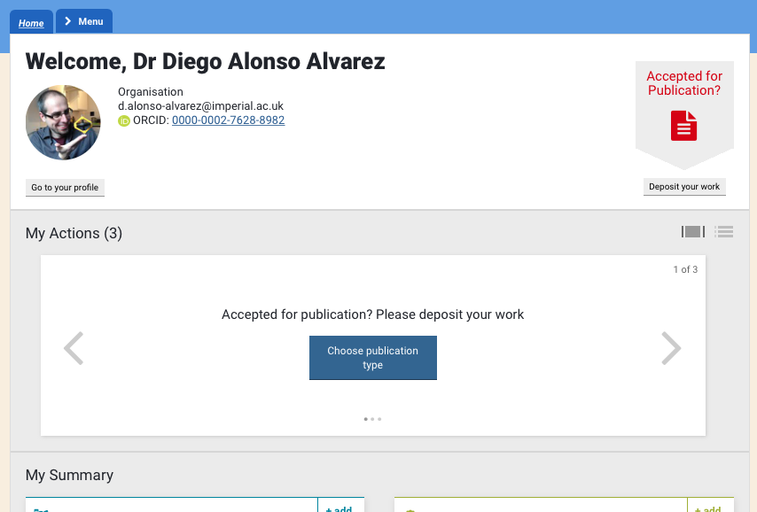
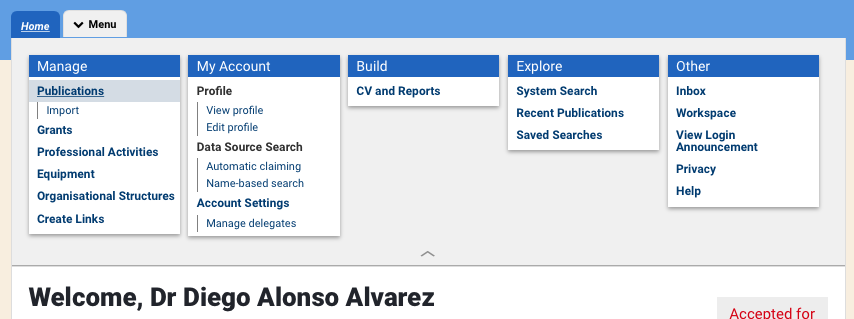
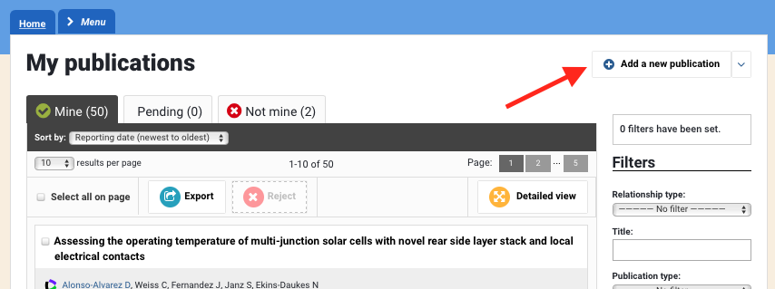
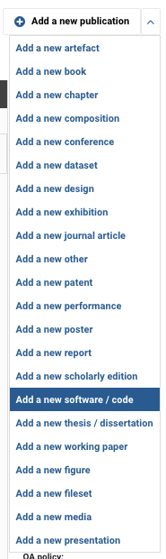
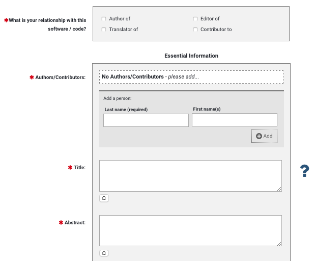
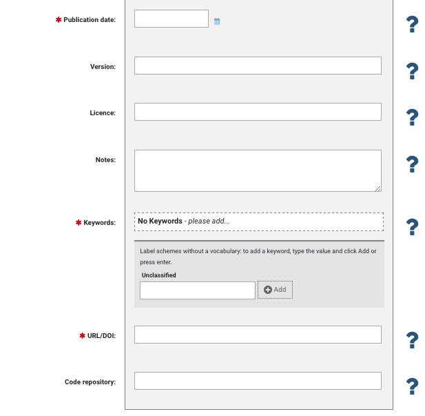
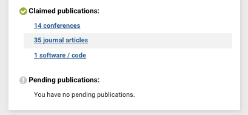

# How to report software outputs in Symplectic Elements

This guide shows the method for recording software outputs in Symplectic Elements as implemented at Imperial College London (16th October 2019). A video tutorial of the process can also be found [in this link](https://www.imperial.ac.uk/research-and-innovation/support-for-staff/scholarly-communication/research-data-management/training-and-resources/how-to-videos/).

After logging into Symplectic, you will go straight to your "**Home**", which shows a summary of your publications, grants and gives you a couple of choices to deposit your work after it has been published.

None of these options are useful for software, but just for journal or conference publications. To add a software, go to the "**Menu**" tab at the top, and then to "**Publications**", under the "**Manage**" card on the left hand side. 

This will bring you to your complete publications list, showing those that you have claimed, those that are pending and those that you have rejected - possibly because they have been wrongly identified as yours by the system. On this screen, click on "**Add a new publication**" on the top-right corner:

A very large list of types of outcomes to add opens - good to remind you of other things that you could (should) be submitting - and among them, "**Add a new software / code**".

When selecting that option, the process of adding a new software starts:

1 - A screen appears to search for the software, just in case it is already in the database (it might have been added by a colleague).

2 - Assuming that is not the case, then a form opens to add all the information related to the software, including:

   - Authors and contributors
   - Title of the software
   - Abstract

   - Publication date
   - Version
   - License
   - Keywords
 
And the two most important bits:

   - DOI
   - Code repository 
    

3 - After saving this form, the software is already added, but you are given the option to link some funding that is related to this software (for example, if it was develop as part of a particular EPSRC or EU grant)

That is all! If you now return to your "**Home**" page, you should see a new "**Claimed publication**" of type "**software / code**".

